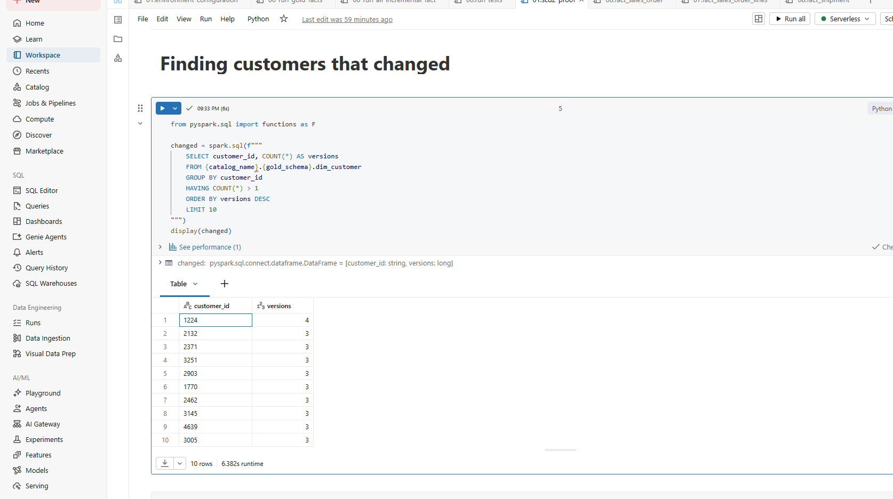
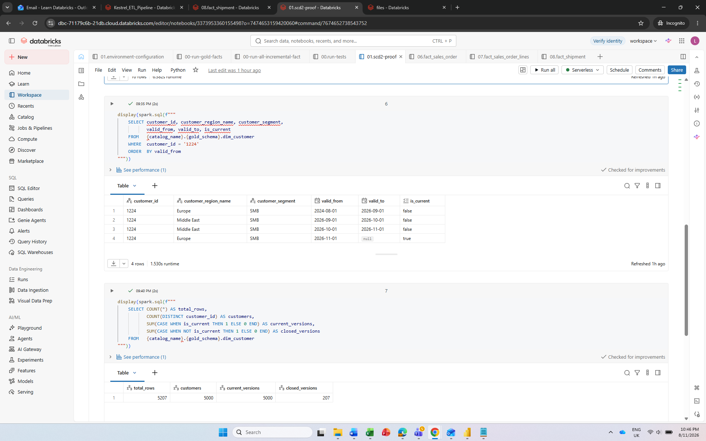
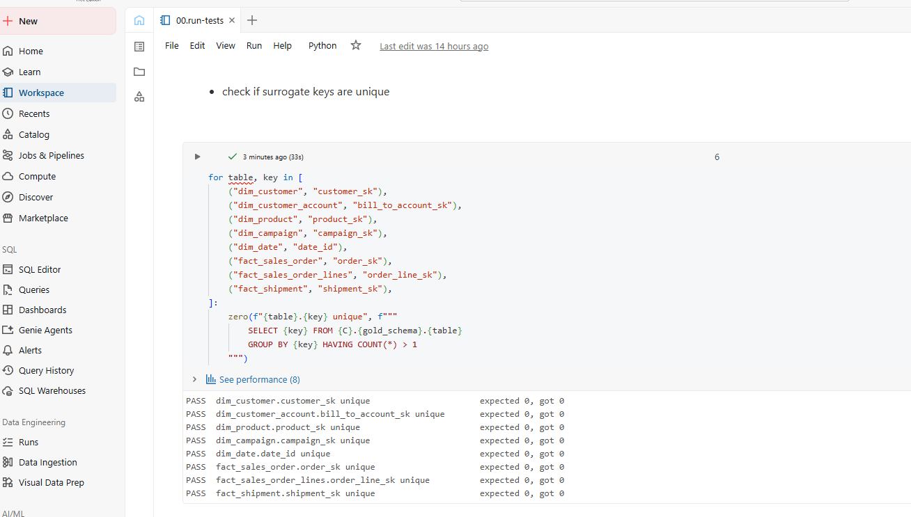
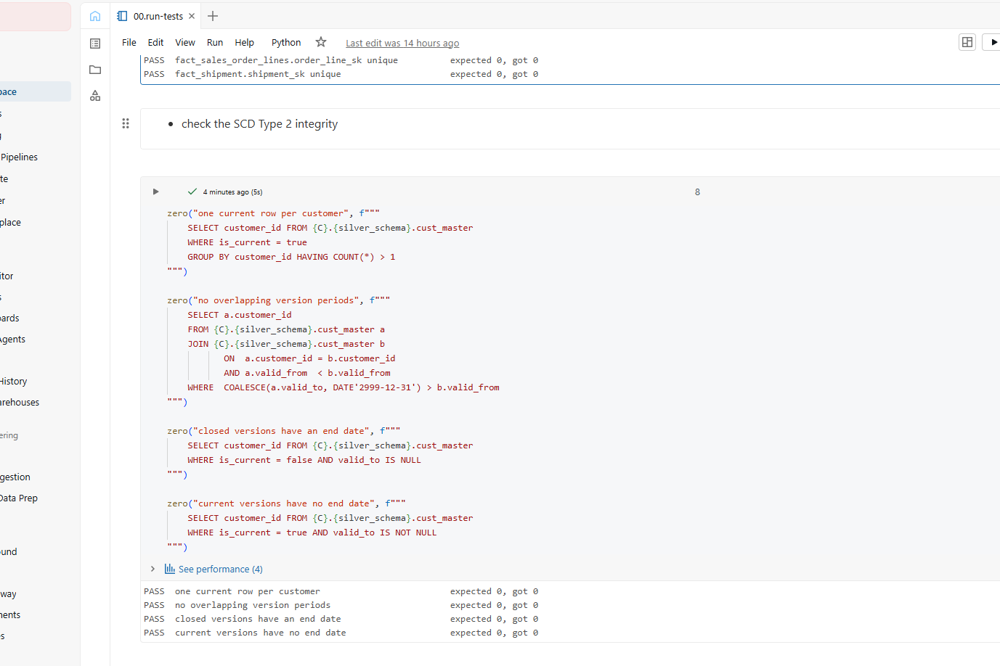
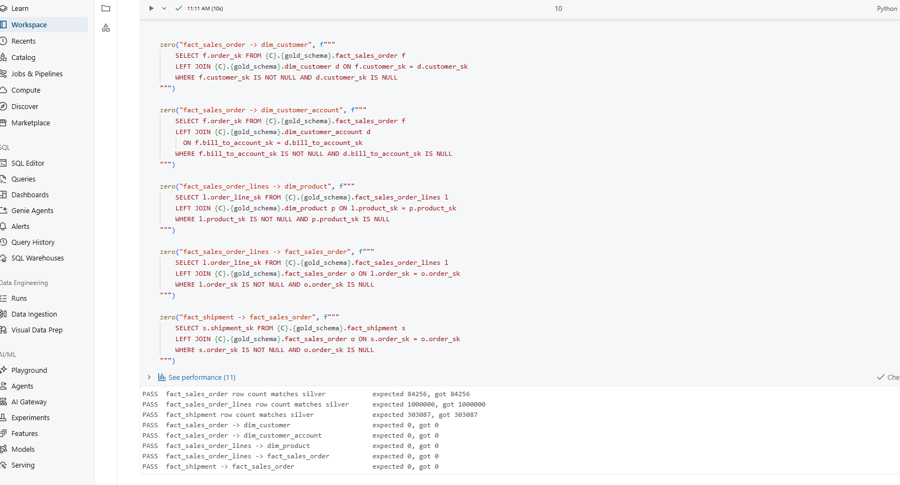
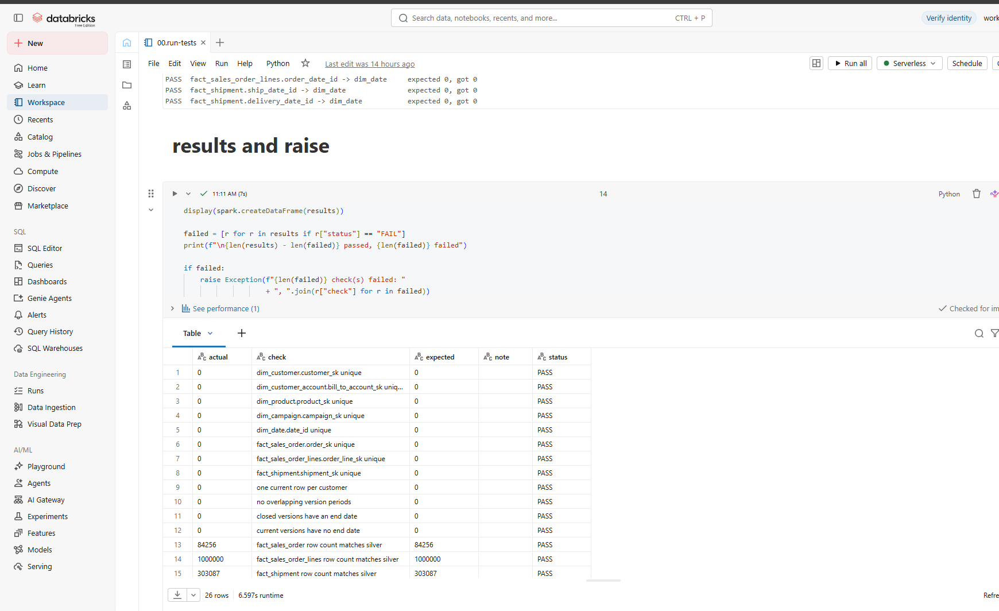
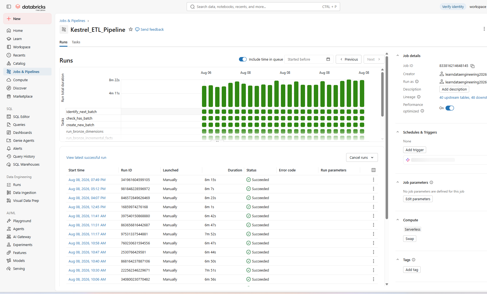
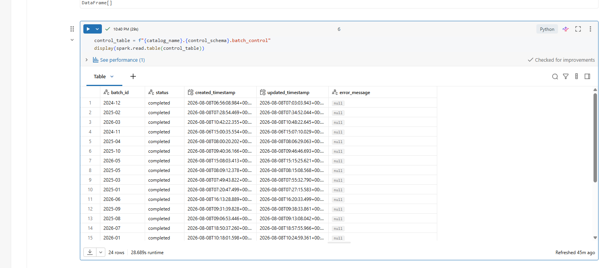
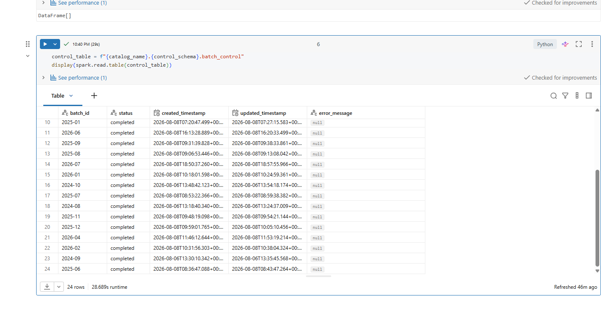
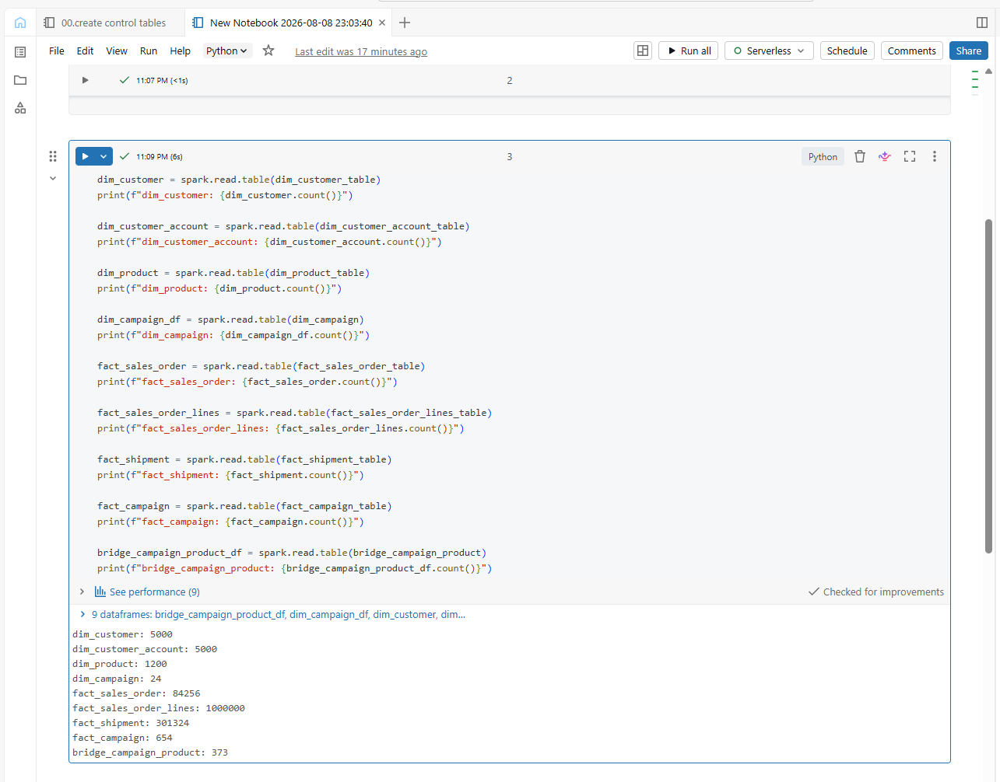

**An end-to-end order-to-cash lakehouse on Databricks**

Monthly files land in a volume, pass through bronze, silver and gold, and end as a star schema for reporting. It runs on a schedule, tracks its own progress, and refuses to complete a batch that does not reconcile.


---

## Repository

```
kestrel-data-engineering/
├── 00-common/                              config and shared helper notebooks
├── 01-environment-setup/                   catalog, schemas, landing volume
├── 02-bronze-dimension/                    13 reference tables, full load
├── 03-bronze-incremental-fact/             6 transactional tables, incremental
├── 04-bronze-to-silver-transformation/     19 tables, cleaned and conformed
├── 05-gold/                                5 dimensions, 4 facts, 1 bridge
├── 06-orchestration/                       control table and job tasks
├── 07-tests/                               reconciliation checks and SCD2 proof
├── jobs/                                   exported workflow definition
└── docs/
    └── images/
```

---

## The business

Kestrel Global Trading is a London-based B2B distributor. Five thousand trade customers across 40 cities and five regions, moving 1,200 SKUs. It holds and ships stock but does not manufacture, and fulfilment runs through five contracted carriers.

Order, invoice, payment and shipment data arrives as monthly file drops from systems that does not integrate. Analysts rebuild the data in a spreadsheet each month. It takes a week and breaks when someone is on leave.

---

## The business problem

**There is no single source of truth.** Order data sits in the ERP, invoices in the finance system, payments in the treasury export, shipments in carrier reports, and reference data in a set of spreadsheets that individual teams maintain. Every one of them drops files monthly. Nobody has ever joined them end to end.

**Reporting is manual and it does not scale.** The first week of every month is spent on stitching those files together in Excel. The workbook is now large enough to crash, the formulas are undocumented, and when one of the analysts is on leave the month-end pack is late. Two years of trading is roughly 1.4 million transaction rows, which is well past what a spreadsheet should be asked to hold.

**The ERP migration broke historical continuity.** The legacy system named its columns one way, the new system names them another, and the 2026 extract added a field neither of the others has. Any attempt to look at trading across the full two years falls over at the boundary.

**Data arrives late and out of order.** Payments in particular land months after the order they settle. Because the analysts filter by order date when they refresh, late payments are silently missed. Numbers reported in one month quietly change the next, and nobody can explain why.

**There is no history and no audit trail.** Reference files are overwritten each month. When a customer moves between regions, last year's regional numbers change retrospectively. There is no record of what the data looked like when a decision was made.

My job was to replace that spreadsheet with a pipeline that loads itself, records what it has done, and produces numbers anyone can trace back to a source file.

---

## The data

The data is **synthetically generated** to simulate Kestrel's operating environment. A generator script models a genuine order-to-cash process, then deliberately introduces the defects found in production systems: inconsistent naming between legacy and current platforms, late-arriving records, duplicate master data, schema changes between extracts, and missing values.

Source systems export monthly. Each export produces a dated batch, and batches accumulate in the landing area rather than overwriting.

**Coverage:** August 2024 to July 2026, 24 months, 151 batch files.

### Transactional feeds, batched monthly

| Dataset | Format | Batches | Rows | Partitioned by |
|---|---|---|---|---|
| `orders_legacy` | Parquet | 5 | ~85,000 | Order month |
| `orders_2025` | Parquet | 12 | ~200,000 | Order month |
| `orders_2026` | Parquet | 7 | ~115,000 | Order month |
| `order_line_items` | Parquet | 24 | 1,000,000 | Order month |
| `invoices` | Parquet | 25 | 352,388 | Invoice month |
| `invoice_lines` | Parquet | 25 | 880,946 | Invoice month |
| `payments` | Parquet | 28 | 302,349 | Payment month |
| `shipments` | Parquet | 25 | 405,246 | Shipment month |

### Reference data, delivered as flat files

| Dataset | Format | Rows | Content |
|---|---|---|---|
| `CUST_MASTER` | CSV | 5,100 | Customer master from the legacy platform |
| `customer_contacts` | CSV | 5,000 | Contact names, emails, phone numbers |
| `Address` | CSV | 10,000 | Billing and shipping addresses |
| `cities` | CSV | 40 | City to region mapping |
| `regions` | CSV | 5 | Region reference |
| `products` | CSV | 1,200 | Product master with cost and list price |
| `subcategories` | CSV | 18 | Product hierarchy |
| `channels` | CSV | 4 | Sales channel reference |
| `CAMPAIGN_LOG` | CSV | 654 | Denormalised daily marketing log |
| `campaign_skus` | CSV | 377 | Campaign to SKU mapping |
| `sales_targets` | CSV | 115 | Monthly revenue target by region |
| `exchange_rates` | CSV | 144 | Monthly conversion rate to sterling |
| `user_details` | CSV | 6 | User to region mapping |

### What makes it awkward

**Different formats.** Transactional data arrives as Parquet with typed schemas. Reference data arrives as CSV, produced by whoever owns the spreadsheet. Two file formats, two levels of reliability, one pipeline.

**Different naming conventions.** Legacy tables use uppercase with abbreviations: `ORDER_NO`, `ORD_DT`, `CUST_ID`, `PRIORITY_CD`. Current tables use lowercase with full words. `CUST_MASTER` and `CAMPAIGN_LOG` still carry legacy naming despite being current files.

**Different vocabularies for the same thing.** The legacy order status is `DELIVERED`; the current one is `Delivered`. Legacy priority is `STD` and `EXP`; current is `Standard` and `Express`. Union them without normalising and every priority-level report silently splits into six categories instead of three.

**Schema drift between extracts.** The 2026 order file carries an `order_source` column the earlier files do not. A pipeline holding a fixed schema would not fail on it. It would drop the column without a word.

**Different grains in the same chain.** Orders are one row per order, line items one row per line. Shipments and payments both fan out, so a single order can have several of each. Joining the chain inflates row counts by roughly a quarter.

**Different event clocks.** Each feed partitions by its own event date, not by order date. A January order can be invoiced in February and paid in May, so its three records sit in three batches spread across five months.

**Five currencies.** Invoices are raised in the customer's local currency. Group reporting is in sterling, so nothing can be totalled until every value converts at the rate for its invoice month.

**Genuine defects.** Duplicate customer IDs in the master file. Null SKUs on order lines. Order headers with no lines attached. Missing invoice totals.

---

## What this project sets out to do

| # | Aim | Delivered by |
|---|---|---|
| 1 | **Data ingestion** | Landing → Bronze, parameterised by batch_id |
| 2 | **Data transformation** | Bronze → Silver, cleaned and conformed |
| 3 | **Reporting and analytics** | Silver → Gold, dimensional model |
| 4 | **Historical accuracy** | Type 2 customer dimension with point-in-time joins |
| 5 | **Data quality** | Issues investigated before rules were written, and how each was handled |
| 6 | **Testing** | Reconciliation checks that fail the batch |
| 7 | **Automated orchestration** | Control table and Databricks Workflow |
| 8 | **Data dictionary** | Every gold table, column and business rule documented |


---

## Environment setup

| Step | Detail |
|---|---|
| Platform | Databricks Free Edition, serverless compute |
| Governance | Unity Catalog, one metastore assigned to the workspace |
| Storage | Databricks-managed. No external cloud storage account is used |
| Catalog | `kestrel_data_eng_prj`, created without an explicit managed location so it inherits the metastore default |
| Landing volume | Managed volume `landing.files`, created without a location clause |
| File delivery | Batch folders uploaded to the volume through Catalog Explorer |

### Catalog structure

```
kestrel_data_eng_prj
├── landing     managed volume holding the raw file drop
├── bronze      raw ingest, one table per source
├── silver      cleaned and conformed
├── gold        dimensional model
└── control     batch control and audit tables
```

```sql
CREATE CATALOG IF NOT EXISTS kestrel_data_eng_prj;
USE CATALOG kestrel_data_eng_prj;

CREATE SCHEMA IF NOT EXISTS landing;
CREATE SCHEMA IF NOT EXISTS bronze;
CREATE SCHEMA IF NOT EXISTS silver;
CREATE SCHEMA IF NOT EXISTS gold;
CREATE SCHEMA IF NOT EXISTS control;

CREATE VOLUME IF NOT EXISTS kestrel_data_eng_prj.landing.files;
```

No `MANAGED LOCATION` on the catalog and no `LOCATION` on the volume, so both use the metastore's default Databricks-managed storage. Every statement uses `IF NOT EXISTS`, so the notebook can be run again without failing.

### Notebook structure

```
/kestrel_data_eng_prj/
├── 00-common/
│   ├── 01.environment-configuration
│   ├── 02.bronze-helpers
│   ├── 03.silver-helpers
│   └── 04.gold-helpers
├── 01-environment-setup/
├── 02-bronze-dimension/
├── 03-bronze-incremental-fact/
├── 04-bronze-to-silver-transformation/
├── 05-gold/
├── 06-orchestration/
└── 07-tests/
```

Folder names mirror the schemas, so the shape of the pipeline is visible from the workspace tree without reading any code.

📁 [`01-Environment-setup/`](01-Environment-setup)

---

## How to run it

1. Run `01-environment-setup` to create the catalogue, schemas and volume.
2. Run `06-orchestration/00.create-control-tables`.
3. Upload batch folders to `/Volumes/kestrel_data_eng_prj/landing/files/`, one folder per month.
4. Import `jobs/kestrel_etl_pipeline.json` through Workflows.
5. Run the job. It picks up the earliest unprocessed batch on its own.

---

## Shared components

Rather than repeating configuration and write logic in every notebook, four shared notebooks sit in `00-common` and are pulled in with `%run` wherever they are needed. A change to the write pattern happens in one place and applies everywhere.

| Notebook | Holds | Used by |
|---|---|---|
| `01.environment-configuration` | Catalog and schema names, the landing volume path, a path variable per source dataset. Configuration only, no logic | Every notebook |
| `02.bronze-helpers` | `add_ingestion_metadata`, `write_to_bronze` | Bronze notebooks |
| `03.silver-helpers` | `trim_whitespaces`, `remove_nulls`, `remove_duplicates`, `write_to_silver`, `write_to_silver_scd2` | Silver notebooks |
| `04.gold-helpers` | `write_to_gold` | Gold notebooks |

**Bronze helpers.** `add_ingestion_metadata` attaches an ingestion timestamp and the originating file path to every row, using Spark's built-in `_metadata` column so provenance does not have to be assembled by hand for each reader. `write_to_bronze` stamps the batch identifier onto the data and writes it as a Delta table partitioned by `batch_id`, using `replaceWhere` so reprocessing a batch replaces it in place rather than appending a second copy.

**Silver helpers.** `trim_whitespaces` normalises leading, trailing and repeated internal whitespace across string columns only, leaving typed columns untouched. `remove_nulls` and `remove_duplicates` handle business key integrity. `write_to_silver` creates the Delta table on first run and merges on the business key thereafter, guarded so an older batch cannot overwrite newer data, and preserving the original creation timestamp when a row is updated. `write_to_silver_scd2` handles the customer dimension, described below.

**Gold helper.** `write_to_gold` creates the Delta table on first run and merges on the surrogate key thereafter, so a rebuild updates rows in place rather than duplicating them. `created_timestamp` is excluded from the update map, so it records when a row first entered the warehouse while only `updated_timestamp` moves. There is no batch guard here, because gold rebuilds from the full silver history each run and the latest write is always the more complete picture.

📁 [`00-common/`](00-common)

---

## 1. Landing → Bronze

Bronze holds the source exactly as delivered. Nothing is cleaned here. Its job is to be the record of what the source actually sent.

**Requirements**
- Ingest every source as delivered
- Explicit schema on read, so a source change fails loudly
- Attach provenance to every row
- Reference data reloads in full; transactional data loads one batch at a time
- Reprocessing a batch must replace it, never duplicate it

**Steps**
- `p_batch_id` widget on every notebook, so one code path serves backfill and incremental
- Shared configuration and helper functions pulled in with `%run`
- Declared `StructType` per CSV source with `FAILFAST`; Parquet read on its own schema
- Columns known to appear later in the timeline are declared from the start, so batches before them read NULL and the change needs no edit
- `add_ingestion_metadata()` stamps ingestion timestamp and source file path
- `write_to_bronze()` writes Delta partitioned by `batch_id`, using `replaceWhere` for idempotency

📁 [`02-bronze-dimension/`](02-bronze-dimension) — 13 reference tables, full load

📁 [`03-bronze-incremental-fact/`](03-bronze-incremental-fact) — 6 transactional tables, incremental load

---

## 2. Bronze → Silver

Cleaned, conformed and merged on the business key.

**Requirements**
- Business-meaningful names in snake_case
- Trim and normalise values; drop columns not needed downstream
- Flag data quality issues rather than silently dropping rows
- Preserve source business keys for traceability
- Log row counts at every stage

**Steps**
- Read bronze filtered to the current batch
- Rename and project only what analytics needs
- Trim and normalise whitespace across string columns
- Apply quality flags; remove rows only where the business key is null
- Deduplicate deterministically on the declared business key, using `row_number` rather than `dropDuplicates`
- `write_to_silver()` merges on the business key, guarded so an older batch cannot overwrite newer data

📁 [`04-bronze-to-silver-transformation/`](04-bronze-to-silver-transformation) — 19 tables

---

## 3. Silver → Gold

Star schema built for analysis. Five dimensions, four facts, one bridge.

**Requirements**
- Conformed dimensions, one fact per business event at its own grain
- Deterministic surrogate keys that survive a rebuild
- Row count in equals row count out, no fan-out
- Derived business measures live here, not in silver

**Steps**
- Checked the grain of every silver source before building anything: business key, uniqueness, null rates
- Validated the driver table before building
- Generated surrogate keys with `xxhash64` on the business key
- Pre-aggregated one-to-many sources before joining, so facts hold their grain
- Left joins throughout, so no fact row is lost to a missing dimension
- Added derived columns: net line value, GBP conversion, cycle times, date keys, status flags
- Validated output, then `write_to_gold()` merges on the surrogate key


### Date dimension

`dim_date` is generated rather than sourced, covering January 2024 to December 2027. It is keyed on `date_id` as a `yyyyMMdd` string, matching the keys the facts already carry, so no casting was needed anywhere else.

It is a role-playing dimension: one table joined several times under different aliases, once per date role. Nothing volatile is stored, since attributes like "is current month" are wrong the day after they are written. A `month_id` in `yyyyMM` sits alongside the daily key, so monthly facts join at their own grain without a second table.

📁 [`05-gold/`](05-gold)

---

## 4. Historical accuracy: slowly changing dimensions

Reporting is judged on year-on-year comparison, which only holds if the attributes used to slice the data reflect what was true at the time of the transaction.

A customer sits in the EU region for the whole of 2025 and books revenue there. In 2026 the account moves to the Middle East. Overwrite the record and every historical order they placed reports under the new region. EU's 2025 revenue drops, MEA's rises, and nobody changed a transaction. That is the retrospective-change problem set out in the business case.

`silver.cust_master` is therefore Type 2. Each record carries `valid_from`, `valid_to`, `is_current` and a `row_hash` of the tracked columns.

**Tracked columns**, whose change opens a new version: segment, city, credit limit, payment terms and active flag. A column is tracked if changing it would alter a historical report.

**Untracked columns** overwrite in place: name, account manager, created date. Nobody reports revenue by who owned the account two years ago, and a typo correction should not split a customer's history in two.

**Change detection** compares a single SHA-256 hash of the tracked columns rather than every column individually. Adding a tracked column means editing one list.

**The merge is the awkward part.** A Delta `MERGE` allows one action per matched row, but a Type 2 change needs two: close the old version and insert the new one. Each changed record is therefore staged twice, once with a null merge key so it finds no match and falls through to the insert, once with the real key so it matches and closes the old row. One merge, both outcomes, one transaction.

**In gold**, `dim_customer` holds every version and its surrogate key hashes `customer_id` plus `valid_from`, so each version has its own key. Facts join point-in-time:

```python
.join(dim_customer_df.alias("dc"),
      (F.col("so.customer_id") == F.col("dc.customer_id"))
      & (F.to_date(F.col("so.order_date")) >= F.col("dc.valid_from"))
      & (F.to_date(F.col("so.order_date")) <
         F.coalesce(F.col("dc.valid_to"), F.lit("2999-12-31").cast("date"))),
      "left")
```

Exactly one version can satisfy all three conditions, so the join returns one row per order. This is worth stressing: a Type 2 dimension turns every plain equality join into a fan-out, and the point-in-time predicate is what stops it.

`dim_customer_account` stays Type 1, filtered to the current version. It holds credit limit, terms and account manager, which describe where the account stands now. Making both dimensions Type 2 would mean two point-in-time joins on every fact for no analytical gain. Term history remains in silver if it is ever needed.

### Proof




Regional revenue for 2025 is identical before and after the batch in which customers change region. Joining through to the current version instead, which is what an overwrite would give, moves revenue between regions for a period in which no transaction changed.

Customers whose account manager changed produced no new versions, because that column is not tracked.

---

## 5. Data quality

Four things were checked before any cleaning rule was written. In each case the obvious fix was the wrong one.

**Duplicates in the order lines were not duplicates.**

Checking `order_id` plus `product_sku` returned 2,621 rows. Deduplicating on that pair would have deleted about 1,900 valid revenue lines.

Two things were going on. Six hundred of the rows had a null SKU, and a duplicate check treats null as matching null, so two different products looked identical. The rest were split lines: unit price was the same in every group, but the discount rate differed in two thirds of them. Part of an order takes a volume discount, part does not, so order entry writes two lines for the same product.

`order_line_id` is the only column that expresses the grain, so that is the merge key. The handful of groups that match on quantity and discount as well are flagged, not removed, because the table has no line number or delivery date to tell a deliberate split from a re-keying error.

**Fifteen thousand lines have no product code.**

That is 1.5% of lines, carrying £37.9m of revenue. Dropping them would understate group revenue with nothing to show it had happened.

Unit price identifies the product for 98.9% of them, since almost every SKU has a price unique to it. That was published as a finding rather than used as a fix. Deriving a business key from a measure breaks the moment a price changes, and it would paper over a defect the source system should correct.

The lines are flagged and routed to an unknown product member in gold, so the revenue stays in the totals.

**A hundred customers appear twice.**

Only two columns differ between the pairs: the created date, and payment terms in two thirds of cases. Everything else matches, so these are the same customer recorded twice.

`Prepaid` shows up only in the earlier record and never the later one, which is a customer moving onto credit terms. The later record is therefore the current agreement and wins. The superseded row is flagged rather than deleted.

A soft `dropDuplicates` never removed them, because the rows genuinely differ on those two columns. The fault only surfaced when Type 2 forced the table to hold exactly one current row per key. Deduplication now uses `row_number` over `customer_id`, ordered by created date, and runs before the merge, because a Delta merge fails when two source rows match one target row.

**Revenue is overstated at source.**

`line_total` is quantity times unit price. The discount rate is populated and never applied.

Both values are carried into gold: `line_total` exactly as delivered, and `net_line_value` calculated properly alongside it. Reporting uses the second. Keeping both means the gap can be measured and raised with the source system.

---

## 6. Testing

Every batch runs a set of checks after the gold layer is built. A failure raises, which fails the job task and triggers `fail_batch`, so a broken batch never reaches reporting.

| Check | What it catches |
|---|---|
| Surrogate keys unique across all eight gold tables | A join that fanned out |
| One current row per customer | A broken Type 2 merge |
| No overlapping version periods | Versions that opened before the previous one closed |
| Closed versions have an end date, current versions do not | Half-applied merges |
| Fact row counts match their silver driver | Rows lost or duplicated between layers |
| No orphaned foreign keys, facts to dimensions | A dimension rebuilt without its facts |
| Every date key resolves to the calendar | A date outside the generated range |
| Net revenue reconciles from silver to gold | Anything the row counts missed |

Thirty-two checks in total.

The reconciliation check is the one that matters most. Row counts can match while values are wrong, so the last check recomputes revenue from the silver line items and compares it to the gold total.

The tests earned their place on the first run. Introducing Type 2 turned the customer join into a fan-out, which duplicated 822 orders. Merging cannot remove rows it did not create, so the facts had to be dropped and rebuilt. Without the uniqueness check, 822 duplicated orders would have shipped and shown up later as a revenue figure that was wrong with no obvious cause.

**Surrogate key uniqueness**



**Type 2 integrity**



**Facts reconcile to silver**



**All checks**



📁 [`07-tests/`](07-tests)

---

## 7. Orchestration

The pipeline runs as one Databricks Workflow, `Kestrel_ETL_Pipeline`, on serverless compute. It finds its own work, processes a batch end to end, checks the result, and records what it did.


**Requirements**
- Find the next unprocessed batch without being told which one
- Process batches oldest first, so ingestion follows the order the source delivered
- Finish successfully when there is nothing to do, rather than failing
- Resolve the batch identifier once and pass it to every task
- Keep batch state visible and queryable at all times
- Return a failed batch to the queue instead of letting it block the pipeline
- Never process the same batch twice
- Keep the job to a readable number of tasks, without one task per source table

### Control table

`control.batch_control` is the pipeline's memory. Nothing is held between runs in code, because the table records what has already been handled.

| Column | Purpose |
|---|---|
| `batch_id` | The batch folder being processed |
| `status` | `in-progress`, `completed` or `failed` |
| `created_timestamp` | When the batch was claimed |
| `updated_timestamp` | When its status last changed |
| `error_message` | Populated when a run fails |

Rows are appended rather than overwritten, so a batch that took several attempts keeps its full history.

📁 [`06-orchestration/`](06-orchestration)

### Layer driver notebooks

The pipeline has 48 table notebooks: 13 bronze reference, 6 bronze transactional, 19 silver and 10 gold. Wiring each as its own job task would give a workflow of over fifty tasks.

That was rejected for three reasons. A DAG that wide cannot be read or screenshotted. Every task starts serverless compute separately, and on Free Edition that consumption adds up fast. And adding a source table would mean editing the job definition rather than a list.

Instead, one driver notebook per layer calls its table notebooks in order:

| Driver | Calls | Job task |
|---|---|---|
| `02-bronze-dimension/00.run-bronze-dimensions` | 13 reference notebooks | `run_bronze_dimensions` |
| `03-bronze-incremental-fact/00.run-bronze-incremental-facts` | 6 transactional notebooks | `run_bronze_incremental_facts` |
| `04-bronze-to-silver-transformation/00.run-all-silver` | 19 notebooks | `run_silver` |
| `05-gold/00.run-gold-dimensions` | 5 dimension notebooks | `run_gold_dimensions` |
| `05-gold/00.run-gold-facts` | 4 facts and the bridge | `run_gold_facts` |

Each driver takes `p_batch_id` from the job, then chains its notebooks with `%run`. The batch identifier is read once at the top and every inlined notebook picks it up from the shared context.

```python
dbutils.widgets.text("p_batch_id", "")
v_batch_id = dbutils.widgets.get("p_batch_id")
```
```
%run ./01.address
```
```
%run ./02.campaign_log
```

`%run` rather than `dbutils.notebook.run`, because Free Edition permits one concurrent run and a nested run fails immediately with `REQUEST_LIMIT_EXCEEDED`. `%run` executes inline in the same context, so no new run is created.

**Order is the dependency.** `%run` blocks until the notebook finishes, so listing them in sequence is enough. This matters most in gold, where facts take their surrogate keys from the dimensions, which is why dimensions and facts are separate tasks.

**Failures still propagate.** A notebook that raises stops the cell, fails the driver, fails the job task, and triggers `fail_batch`.

Adding a source table means one line in a driver notebook. The job definition does not change. Over fifty tasks becomes eleven.

### Tasks

Eleven tasks. Every task from `create_new_batch` down takes `p_batch_id` as a parameter, sourced from the first task.

| Task | Type | Depends on |
|---|---|---|
| `identify_next_batch` | Notebook | — |
| `check_has_batch` | If/else condition | `identify_next_batch` |
| `create_new_batch` | Notebook | `check_has_batch` (true) |
| `run_bronze_dimensions` | Notebook | `create_new_batch` |
| `run_bronze_incremental_facts` | Notebook | `run_bronze_dimensions` |
| `run_silver` | Notebook | `run_bronze_incremental_facts` |
| `run_gold_dimensions` | Notebook | `run_silver` |
| `run_gold_facts` | Notebook | `run_gold_dimensions` |
| `run_tests` | Notebook | `run_gold_facts` |
| `complete_batch` | Notebook | `run_tests` |
| `fail_batch` | Notebook | all processing tasks, run if at least one failed |

**Condition expression**

```
{{tasks.identify_next_batch.values.has_batch}} == true
```

**Parameter passed to every downstream task**

```
p_batch_id = {{tasks.identify_next_batch.values.p_batch_id}}
```

`fail_batch` uses **Run if dependencies: at least one failed**, so it fires only when something upstream breaks.

### What each run does

`identify_next_batch` lists the landing volume, keeps only directories, and compares them against batches the control table already holds at `in-progress` or `completed`. The earliest untracked batch wins. Two task values are published: `p_batch_id` with the batch, and `has_batch` as a flag.

`check_has_batch` routes on that flag. With nothing new, the run ends green rather than failing, which matters for a scheduled job that fires whether or not files have arrived.

`create_new_batch` writes the batch to the control table at `in-progress`, claiming it.

The five processing tasks run in sequence: bronze dimensions, bronze facts, silver, gold dimensions, gold facts. Order matters in gold, since facts take their surrogate keys from the dimensions. `run_tests` then checks the result.

`complete_batch` merges the batch to `completed` using a condition requiring the current status to be `in-progress`. A batch can therefore only be completed if it was properly started, and re-running the task cannot alter a finished row.

`fail_batch` marks the batch `failed` with an error message. Because `identify_next_batch` treats only `in-progress` and `completed` as tracked, a failed batch becomes eligible again on the next run with no manual intervention.

### Worth knowing

**`has_batch` is a string, not a boolean.** The condition task compares values as text, so a Python boolean would serialise as `False` with a capital F and the comparison would never match.

**Gold dimensions and facts are separate tasks.** Everything else could be one driver per layer, but facts take their surrogate keys from the dimensions. Splitting them puts that dependency in the job DAG rather than hiding it inside a notebook.

---

## 8. Data dictionary

Reference for the gold layer, which is what reporting queries. Silver and bronze are listed at the end.

Every gold table carries `created_timestamp` (when the row first entered gold) and `updated_timestamp` (when it was last rebuilt). These are omitted below to save repetition.

### Dimensions

#### dim_date

One row per calendar day, January 2024 to December 2027, plus one unknown member.

| Column | Type | Description |
|---|---|---|
| `date_id` | string | Key, `yyyyMMdd`. `-1` for the unknown member |
| `full_date` | date | The date itself |
| `day_of_month` | int | 1 to 31 |
| `day_name` | string | Monday to Sunday |
| `day_short_name` | string | Mon to Sun |
| `day_of_week` | int | 1 to 7, Monday first |
| `is_weekend` | boolean | True for Saturday and Sunday |
| `week_of_year` | int | ISO week number |
| `month_number` | int | 1 to 12 |
| `month_name` | string | January to December |
| `month_short_name` | string | Jan to Dec |
| `month_year` | string | `2025-01`, sorts correctly as text |
| `month_id` | string | Month key, `yyyyMM`, for monthly facts |
| `month_start_date` | date | First day of the month |
| `month_end_date` | date | Last day of the month |
| `quarter_number` | int | 1 to 4 |
| `quarter_name` | string | Q1 to Q4 |
| `quarter_year` | string | `2025-Q1` |
| `calendar_year` | int | Calendar year |
| `fiscal_year` | int | Year the fiscal year starts in. April 2025 to March 2026 is FY2025 |
| `fiscal_month_number` | int | 1 to 12, April first |
| `fiscal_quarter_number` | int | 1 to 4, fiscal |

**Notes.** Role-playing dimension, joined once per date role on each fact. The fiscal year starts in April.

#### dim_customer

One row per customer **version**. Type 2.

| Column | Type | Description |
|---|---|---|
| `customer_sk` | bigint | Surrogate key. Hash of `customer_id` plus `valid_from`, so each version has its own key |
| `customer_id` | string | Business key from the source customer master |
| `customer_name` | string | Trading name |
| `customer_segment` | string | SMB, Mid-Market or Enterprise. **Tracked** |
| `customer_active_flag` | string | Y or N. **Tracked** |
| `customer_street` | string | Ship-to street |
| `customer_postal_code` | string | Ship-to postcode |
| `customer_address_type` | string | Address role, always SHIP_TO in this dimension |
| `customer_city_id` | string | Foreign key to the city reference. **Tracked** |
| `customer_city_name` | string | City |
| `customer_region_id` | string | Foreign key to the region reference |
| `customer_region_name` | string | Region: EU, US, APAC, LATAM or ME |
| `valid_from` | date | First day this version applies |
| `valid_to` | date | Day the version was superseded. Null on the current version |
| `is_current` | boolean | True on the live version |
| `row_hash` | string | SHA-256 of the tracked columns, used for change detection |

**Notes.** Facts join point-in-time on `order_date` between `valid_from` and `valid_to`. A plain equality join would fan out.

#### dim_customer_account

One row per customer account. Type 1, filtered to the current version.

| Column | Type | Description |
|---|---|---|
| `bill_to_account_sk` | bigint | Surrogate key. Hash of `account_id` |
| `account_id` | string | Business key, same value as `customer_id` |
| `account_segment` | string | SMB, Mid-Market or Enterprise |
| `account_credit_limit` | decimal | Approved credit limit |
| `account_payment_terms` | string | Prepaid, Net 15, Net 30 or Net 60 |
| `account_manager` | string | Owning account manager |
| `account_active_flag` | string | Y or N |
| `customer_account_created_date` | date | When the account was opened |
| `customer_account_created_date_id` | string | Date key, `yyyyMMdd` |
| `account_bill_to_postal_code` | string | Bill-to postcode |
| `account_bill_to_address_type` | string | Address role, always BILL_TO |
| `account_city_id` | string | Foreign key to the city reference |
| `account_city_name` | string | City |
| `account_region_id` | string | Foreign key to the region reference |
| `account_region_name` | string | Region |

#### dim_product

One row per SKU, with its category hierarchy.

| Column | Type | Description |
|---|---|---|
| `product_sk` | bigint | Surrogate key. Hash of `product_id` |
| `product_id` | string | SKU, the business key |
| `product_name` | string | Product name |
| `product_brand` | string | Brand |
| `product_price` | decimal | List price |
| `product_cost` | decimal | Standard cost, used for margin |
| `product_supplier` | string | Supplying vendor |
| `product_sub_category_name` | string | Subcategory, 18 values |
| `product_category_name` | string | Category: Apparel, Beauty, Electronics, Home, Sports or Industrial |

#### dim_campaign

One row per marketing campaign. Attributes arrive repeated on the daily campaign log and are aggregated to campaign grain here.

| Column | Type | Description |
|---|---|---|
| `campaign_sk` | bigint | Surrogate key. Hash of `campaign_id` |
| `campaign_id` | string | Business key |
| `campaign_name` | string | Campaign name |
| `campaign_channel` | string | Display, Email, Paid Search or Social |
| `total_campaign_budget` | decimal | Approved budget for the campaign |
| `campaign_start_date` | date | First day of the campaign |
| `campaign_end_date` | date | Last day of the campaign |
| `campaign_start_date_id` | string | Date key, `yyyyMMdd` |
| `campaign_end_date_id` | string | Date key, `yyyyMMdd` |
| `campaign_duration_days` | int | Length in days, inclusive of both endpoints |

### Facts

#### fact_sales_order

One row per order. Invoice and payment status carried down from the order's invoice.

| Column | Type | Description |
|---|---|---|
| `order_sk` | bigint | Surrogate key. Hash of `order_number` |
| `order_number` | string | Source order number, degenerate dimension |
| `customer_sk` | bigint | Foreign key to `dim_customer`, resolved point-in-time |
| `customer_name` | string | Denormalised from the customer dimension |
| `bill_to_account_sk` | bigint | Foreign key to `dim_customer_account` |
| `account_payment_terms` | string | Denormalised from the account dimension |
| `order_status` | string | Order lifecycle status |
| `channel_name` | string | Sales channel |
| `payment_method` | string | Method on the most recent payment against the invoice |
| `order_date` | date | Date the order was raised |
| `invoice_date` | date | Date the order was invoiced. Null if not yet invoiced |
| `payment_date` | date | Date of first payment. Null if unpaid |
| `order_date_id` | string | Date key, `yyyyMMdd` |
| `invoice_date_id` | string | Date key, `yyyyMMdd` |
| `payment_date_id` | string | Date key, `yyyyMMdd` |
| `order_total_gbp` | decimal | Invoice total converted to sterling at the rate for its invoice month |

**Notes.** Around 12% of orders have no invoice and roughly 22% of invoices are never paid, so null invoice and payment dates are a valid business state rather than missing data. Payments are aggregated to invoice grain before joining, so an invoice settled in instalments does not duplicate the order.

#### fact_sales_order_lines

One row per order line. The transactional grain of the model.

| Column | Type | Description |
|---|---|---|
| `order_line_sk` | bigint | Surrogate key. Hash of `order_line_id` |
| `order_line_id` | string | Source line identifier, the business key |
| `order_sk` | bigint | Foreign key to `fact_sales_order` |
| `sales_order_number` | string | Source order number, degenerate dimension |
| `product_sk` | bigint | Foreign key to `dim_product`. Unknown member where the SKU is missing |
| `product_number` | string | Source SKU. Null on around 1.5% of lines |
| `customer_sk` | bigint | Inherited from the order |
| `bill_to_account_sk` | bigint | Inherited from the order |
| `line_quantity` | int | Units ordered |
| `line_unit_price` | decimal | Price per unit before discount |
| `line_discount_pct` | decimal | Discount rate: 0, 0.05, 0.10 or 0.15 |
| `line_total` | decimal | As delivered by the source. Does **not** apply the discount |
| `net_line_value` | decimal | Calculated: quantity × unit price × (1 − discount). The correct revenue figure |
| `order_status` | string | Inherited from the order |
| `order_date` | date | Inherited from the order |
| `order_date_id` | string | Date key, `yyyyMMdd` |

**Notes.** `line_total` is retained as delivered so the two can be compared. `customer_sk` and `bill_to_account_sk` are inherited from the parent order for convenience when querying this table directly. Customer relationships are held on `fact_sales_order` only, so there is one filter path.

#### fact_shipment

One row per shipment. A shipment is recorded against an order, not an order line.

| Column | Type | Description |
|---|---|---|
| `shipment_sk` | bigint | Surrogate key. Hash of `shipment_number` |
| `shipment_number` | string | Source shipment identifier |
| `order_sk` | bigint | Foreign key to `fact_sales_order` |
| `sales_order_number` | string | Source order number |
| `customer_sk` | bigint | Same value as the order's. Kept for direct querying; the relationship runs through `fact_sales_order` |
| `shipping_carrier` | string | Maersk, DHL, UPS, DSV or Kuehne+Nagel |
| `order_date` | date | Inherited from the order |
| `ship_date` | date | Date the consignment left the warehouse |
| `delivery_date` | date | Date delivered. Null while in transit, around 20% of rows |
| `order_date_id` | string | Date key, `yyyyMMdd` |
| `ship_date_id` | string | Date key, `yyyyMMdd` |
| `delivery_date_id` | string | Date key, `yyyyMMdd` |
| `order_to_ship_days` | int | Days from order to despatch |
| `transit_days` | int | Days from despatch to delivery. Null while in transit |
| `order_to_delivery_days` | int | Total cycle time. Null while in transit |
| `is_delivered` | boolean | True once a delivery date exists |
| `delivery_status` | string | Delivered or In transit |
| `shipment_count_on_order` | int | Total consignments on the parent order |
| `shipment_sequence` | int | Position of this consignment within the order |
| `is_split_shipment` | boolean | True where the order shipped in more than one consignment |
| `batch_id` | string | Batch that delivered the row |

**Notes.** A consignment cannot be attributed to a specific order line, so this fact relates to `fact_sales_order` and never to `fact_sales_order_lines`. Fifteen per cent of orders ship in two consignments and four fifths of those use two carriers, which is why carrier sits here rather than on the order. Null transit days are correct and should not be set to zero, or average transit time drops without explanation.

#### fact_campaign

One row per campaign per day.

| Column | Type | Description |
|---|---|---|
| `campaign_sk` | bigint | Foreign key to `dim_campaign` |
| `campaign_log_date` | date | The day being reported |
| `campaign_log_date_id` | string | Date key, `yyyyMMdd` |
| `campaign_impressions` | bigint | Impressions served |
| `campaign_clicks` | bigint | Clicks recorded |
| `campaign_spend` | decimal | Spend for the day |

**Notes.** Ratios such as click-through rate and cost per click are not stored, because they do not aggregate. Derive them in the reporting layer from the components.

### Bridge

#### bridge_campaign_product

Resolves the many-to-many relationship between campaigns and products. A campaign covers several SKUs and a SKU appears in several campaigns.

| Column | Type | Description |
|---|---|---|
| `campaign_sk` | bigint | Foreign key to `dim_campaign` |
| `product_sk` | bigint | Foreign key to `dim_product` |

**Notes.** Identifies which SKUs a campaign covered. It does not attribute revenue to a campaign, since no order line records the campaign that prompted it.

### Silver layer

Cleaned and conformed, one table per source. Every table carries `batch_id`, `source_file`, `ingestion_timestamp`, `created_timestamp` and `updated_timestamp`.

| Table | Grain | Merged on |
|---|---|---|
| `sales_order` | Order | `order_number` |
| `sales_order_lines` | Order line | `order_line_id` |
| `invoice` | Invoice | `invoice_number` |
| `invoice_lines` | Invoice line | `invoice_number` + `line_number` |
| `payment` | Payment | `payment_id` |
| `shipment` | Shipment | `shipment_id` |
| `cust_master` | Customer version | `customer_id`, Type 2 |
| `address` | Customer and address type | `customer_id` + `address_type` |
| `customer_contacts` | Customer | `customer_id` |
| `products` | SKU | `product_id` |
| `subcategories` | Subcategory | `sub_category_id` |
| `cities` | City | `city_id` |
| `regions` | Region | `region_id` |
| `channels` | Channel | `channel_code` |
| `campaign_log` | Campaign and day | `campaign_id` + `log_date` |
| `campaign_sku` | Campaign and SKU | `campaign_id` + `sku` |
| `exchange_rates` | Currency and month | `currency` + `rate_month` |
| `sales_targets` | Region and month | `region_id` + `target_month` |
| `user_details` | User | `user_id` |

### Bronze layer

Source data as delivered, with provenance attached. Column names and types match the source. Every table adds:

| Column | Type | Description |
|---|---|---|
| `batch_id` | string | Batch folder the row came from |
| `source_file` | string | Full path of the physical file |
| `ingestion_timestamp` | timestamp | When the row was loaded |

Tables are partitioned by `batch_id` and written with `replaceWhere`, so reprocessing a batch replaces it rather than appending.

---

## Key decisions

| Decision | Why |
|---|---|
| `replaceWhere` on the batch partition | Reprocessing replaces rather than duplicates |
| Merge on the business key, not append | Handles corrections and lifecycle updates from later batches |
| Batch guard on the silver merge | Feeds run on different event clocks, so an order can be invoiced and paid months later |
| Flag quality issues, never drop | Consumers see what is wrong instead of rows quietly disappearing |
| Hashed surrogate keys | Deterministic, so a full rebuild orphans nothing |
| Pre-aggregate before joining | A fact can only join to things at or above its own grain |
| Shipment kept as its own fact | Split orders often use two carriers, so carrier cannot collapse to order grain |
| Check duplicates before removing them | Most flagged duplicates in the order lines were valid split lines |
| Never derive a business key from a measure | Price identifies the product for 98.9% of missing SKUs, but using it would break when prices change |
| Type 2 on customer, Type 1 on account | Region and segment slice historical reporting and need versions. Credit terms describe the current position, so versioning them would add a second point-in-time join for no gain |
| Date keys held as strings | `date_format` returns a string, so matching the dimension to the facts avoided casting eight columns across four notebooks |
| Tests fail the batch rather than log a warning | A batch that does not reconcile should not reach reporting |

---

## Results

**Job run history**



**Control table, batch ingestion history**




**Row counts across the dimension and fact tables**



---

## Stack

Databricks (Free Edition) · PySpark · Delta Lake · Unity Catalog · Databricks Workflows

---

## Notes and limitations

- Landing is a Unity Catalog managed volume. In production this would be an ADLS Gen2 external location with a managed identity credential. The pipeline code is unchanged either way, since both resolve to a governed path.
- Layer notebooks are chained with `%run` inside a driver notebook. Free Edition permits one concurrent run, so nested job runs are not available. On a paid workspace each notebook would be its own job task, giving per-table visibility in the job DAG.
- One batch processes per run. A backlog clears over successive runs.
- A cancelled run leaves its batch at `in-progress`, which the discovery step reads as tracked. A stale reset in `identify_next_batch`, flipping any `in-progress` row older than a few hours to `failed`, would close this.
- Type 2 applies to the customer dimension only. Product attributes are overwritten, so a reclassified SKU moves its historical sales to the new category.

