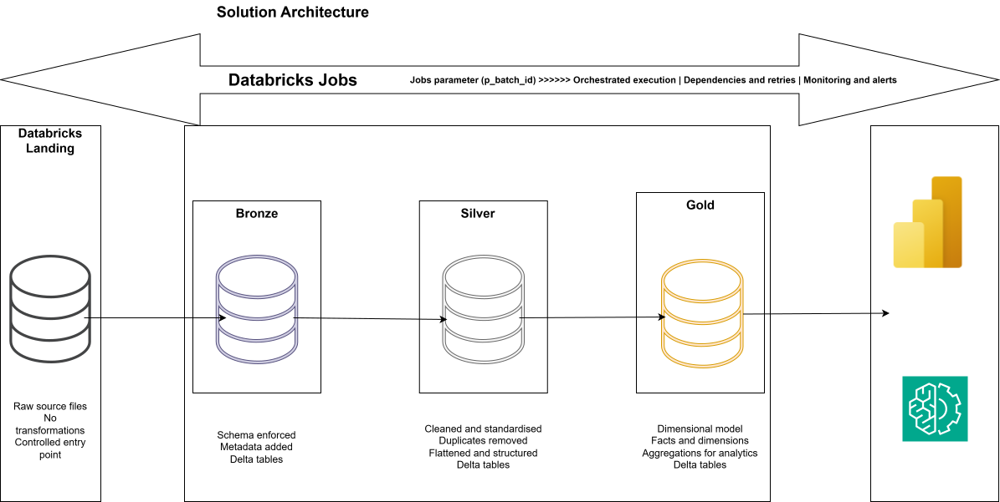
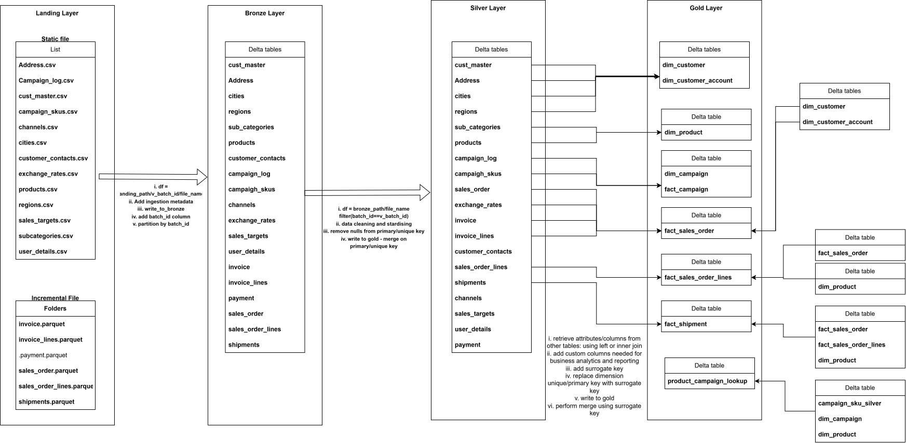
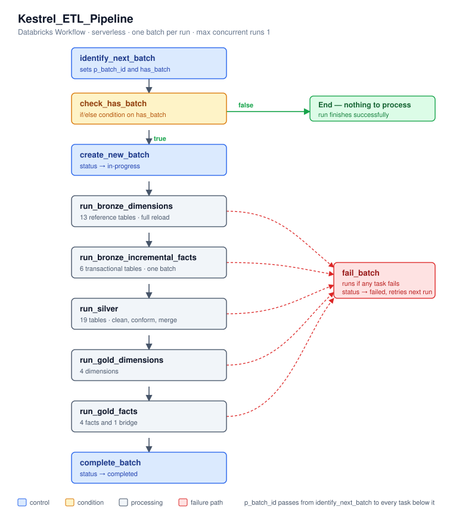

## An end-to-end order-to-cash lakehouse on Azure Databricks

---

Order-to-cash pipeline on Databricks. Monthly files land in a volume, pass through bronze, silver and gold, and end as a star schema for reporting. It runs on a schedule and tracks its own progress.



---

## The business

Kestrel Global Trading is a London-based B2B distributor. Five thousand trade customers across 40 cities and five regions, moving 1,200 SKUs. It holds and ships stock but does not manufacture, and fulfilment runs through five contracted carriers.

Three things about the business show up directly in the data:

Invoices are raised in five currencies. Group reporting is in sterling, so every value converts at the rate for its invoice month.
The ERP was replaced in January 2025. Orders before that date use different column names and status codes, so two years of trading cannot be read without reconciling them.
A digital sales channel launched in January 2026, adding a column the earlier extracts do not have.

Order, invoice, payment and shipment data arrives as monthly file drops from systems that have never spoken to each other. Analysts rebuild the picture in a spreadsheet each month. It takes a week and breaks when someone is on leave.

---

## The business problem

Kestrel has plenty of data and no ability to use it. Specifically:

**There is no single source of truth.** Order data sits in the ERP, invoices in the finance system, payments in the treasury export, shipments in carrier reports, and reference data in a set of spreadsheets that individual teams maintain. Every one of them drops files monthly. Nobody has ever joined them end to end.

**Reporting is manual and it does not scale.** Two analysts spend the first week of every month stitching those files together in Excel. The workbook is now large enough to crash, the formulas are undocumented, and when one of the analysts is on leave the month-end pack is late. Two years of trading is roughly 1.4 million transaction rows, which is well past what a spreadsheet should be asked to hold.

**The ERP migration broke historical continuity.** The legacy system named its columns one way, the new system names them another, and the 2026 extract added a field neither of the others has. Any attempt to look at trading across the full two years falls over at the boundary. The business currently cannot answer "how did this customer perform last year versus this year" without manual mapping.

**Data arrives late and out of order.** Payments in particular land months after the order they settle. Because the analysts filter by order date when they refresh, late payments are silently missed. Numbers reported in one month quietly change the next, and nobody can explain why.

**There is no history and no audit trail.** Reference files are overwritten each month. When a customer moves between regions, last year's regional numbers change retrospectively. There is no record of what the data looked like when a decision was made, which is now a problem for the annual audit.

I have been engaged as a data engineer to design and build a platform that solves these problems: one governed, automated, auditable pipeline that takes the monthly file drops and produces a reporting model the business can trust.

---

## The data

### Simulation note

The data used in this project is **synthetically generated** to simulate Kestrel's real operating environment. It was produced by a generator script that models a genuine order-to-cash process and then deliberately introduces the kinds of defects found in production systems: inconsistent naming between legacy and current platforms, late-arriving records, duplicate master data, schema changes between extracts, and missing values.

### How the data arrives

Source systems export on a monthly cycle. Each export produces a dated batch, and batches accumulate in the landing area rather than overwriting.

**Coverage:** August 2024 to July 2026, 24 months, 151 batch files.

### Transactional feeds, batched monthly

| Dataset | Format | Batches | Rows | Partitioned by |
|---|---|---|---|---|
| `orders_legacy` | Parquet | 5 | ~85,000 | Order month |
| `orders_2025` | Parquet | 12 | ~200,000 | Order month |
| `orders_2026` | Parquet | 7 | ~115,000 | Order month |
| `order_line_items` | Parquet | 24 | 1,000,000 | Order month |
| `invoices` | Parquet | 25 | 352,388 | Invoice month |
| `invoice_lines` | Parquet | 25 | 880,946 | Invoice month |
| `payments` | Parquet | 28 | 302,349 | Payment month |
| `shipments` | Parquet | 25 | 405,246 | Shipment month |

### Reference data, delivered as flat files

| Dataset | Format | Rows | Content |
|---|---|---|---|
| `CUST_MASTER` | CSV | 5,100 | Customer master from the legacy platform |
| `customer_contacts` | CSV | 5,000 | Contact names, emails, phone numbers |
| `Address` | CSV | 10,000 | Billing and shipping addresses |
| `cities` | CSV | 40 | City to region mapping |
| `regions` | CSV | 5 | Region reference |
| `products` | CSV | 1,200 | Product master with cost and list price |
| `subcategories` | CSV | 18 | Product hierarchy |
| `channels` | CSV | 4 | Sales channel reference |
| `CAMPAIGN_LOG` | CSV | 654 | Denormalised daily marketing log |
| `campaign_skus` | CSV | 377 | Campaign to SKU mapping |
| `sales_targets` | CSV | 115 | Monthly revenue target by region |
| `exchange_rates` | CSV | 144 | Monthly conversion rate to sterling |


### The data quality and standardisation issues:

**Different formats.** Transactional data arrives as Parquet with typed schemas. Reference data arrives as CSV, produced by whoever owns the spreadsheet. Two file formats, two levels of reliability, one pipeline.

**Different naming conventions.** Legacy tables use uppercase with abbreviations: `ORDER_NO`, `ORD_DT`, `CUST_ID`, `PRIORITY_CD`. Current tables use lowercase with full words: `order_id`, `order_date`, `customer_id`, `priority`. `CUST_MASTER` and `CAMPAIGN_LOG` still carry legacy naming despite being current files.

**Different vocabularies for the same thing.** The legacy order status is `DELIVERED`; the current one is `Delivered`. Legacy priority is `STD` and `EXP`; current is `Standard` and `Express`. Union them without normalising and every priority-level report silently splits into six categories instead of three.

**Schema drift between extracts.** The 2026 order file carries an `order_source` column that the 2025 and legacy files do not. Any pipeline assuming a fixed schema breaks at the January 2026 boundary.

**Different grains in the same chain.** Orders are one row per order. Line items are one row per line. Shipments and payments both fan out, so a single order can have several of each. Joining the chain inflates row counts by roughly a quarter.

**Different event clocks.** Each feed partitions by its own event date, not by order date. A January order can be invoiced in February and paid in May, so its three records sit in three batches spread across five months.

**Genuine defects.** Duplicate customer IDs in the master file. Null SKUs on order lines. Order headers with no lines attached. Missing invoice totals. Phone numbers exported from Excel with a leading apostrophe. A missing month in the targets file.

---

## The solution

## Requirements

## What this project sets out to do

| # | Aim | Delivered by |
|---|---|---|
| 1 | **Data ingestion** | Landing → Bronze, parameterised by batch |
| 2 | **Data transformation** | Bronze → Silver, cleaned and conformed |
| 3 | **Reporting and analytics** | Silver → Gold, dimensional model |
| 4 | **Automated orchestration** | Control table and Databricks Workflow |
| 5 | **Data dictionary** | Every gold table, column and business rule documented |



---

## Environment setup

### Storage and governance

| Step | Detail |
|---|---|
| Platform | Databricks Free Edition, serverless compute |
| Governance | Unity Catalog, one metastore assigned to the workspace |
| Storage | Databricks-managed. No external cloud storage account is used |
| Catalog | `kestrel_data_eng_prj`, created without an explicit managed location so it inherits the metastore default |
| Landing volume | Managed volume `landing.files`, created without a location clause |
| File delivery | Batch folders uploaded to the volume through Catalog Explorer |

### Catalog structure

```
kestrel_data_eng_prj
├── landing     managed volume holding the raw file drop
├── bronze      raw ingest, one table per source
├── silver      cleaned and conformed
├── gold        dimensional model
└── control     batch control and audit tables
```

Created once, in `00-setup`:

```sql
CREATE CATALOG IF NOT EXISTS kestrel_data_eng_prj;
USE CATALOG kestrel_data_eng_prj;

CREATE SCHEMA IF NOT EXISTS landing;
CREATE SCHEMA IF NOT EXISTS bronze;
CREATE SCHEMA IF NOT EXISTS silver;
CREATE SCHEMA IF NOT EXISTS gold;
CREATE SCHEMA IF NOT EXISTS control;

CREATE VOLUME IF NOT EXISTS kestrel_data_eng_prj.landing.files;
```

No `MANAGED LOCATION` clause is given on the catalog and no `LOCATION` on the volume, so both use the metastore's default Databricks-managed storage.

### Notebook structure

```
/kestrel_data_eng_prj/
├── 00-common/
│   ├── 01.environment-configuration
│   ├── 02.bronze-helpers
│   └── 03.silver-helpers
    └── 04.gold-helpers
├── 01-Environment-setup/
├── 02-bronze-dimension/
├── 03-bronze-incremental-fact/
├── 04-bronze-to-silver transformation/
├── 05-gold/
└── 06-orchestration/
```

Folder names mirror the schemas, so the shape of the pipeline is visible from the workspace tree without reading any code.

---

## Shared components

Rather than repeating configuration and write logic in every notebook, three shared notebooks sit in `00-common` and are pulled in with `%run` wherever they are needed. A change to the write pattern happens in one place and applies everywhere.

| Notebook | Holds | Used by |
|---|---|---|
| `01.environment-configuration` | Catalog and schema names, the landing volume path, a path variable per source dataset. Configuration only, no logic | Every notebook |
| `02.bronze-helpers` | `add_ingestion_metadata`, `write_to_bronze` | Bronze notebooks |
| `03.silver-helpers` | `trim_whitespaces`, `remove_nulls`, `remove_duplicates`, `write_to_silver` | Silver notebooks |
| `04.gold-helpers` | `write_to_gold` | gold notebooks |

**What the bronze helpers do.** `add_ingestion_metadata` attaches an ingestion timestamp and the originating file path to every row, using Spark's built-in `_metadata` column so provenance does not have to be assembled by hand for each reader. `write_to_bronze` stamps the batch identifier onto the data and writes it as a Delta table partitioned by `batch_id`, using `replaceWhere` so that reprocessing a batch replaces it in place rather than appending a second copy.

**What the silver helpers do.** `trim_whitespaces` normalises leading, trailing and repeated internal whitespace across string columns only, leaving typed columns untouched. `remove_nulls` and `remove_duplicates` handle business key integrity. `write_to_silver` creates the Delta table on first run and merges on the business key thereafter, guarded so that an older batch cannot overwrite newer data, and preserving the original creation timestamp when a row is updated.

**What the gold helpers do.** `write_to_gold` creates the Delta table on first run and merges on the surrogate key thereafter, so a rebuild updates rows in place rather than duplicating them. `created_timestamp` is deliberately excluded from the update map, so it records when a row first entered the warehouse while only `updated_timestamp` moves

> Source: `00-common/01.environment-configuration`, `02.bronze-helpers`, `03.silver-helpers`

---

## 1. Landing → Bronze

Raw ingest with provenance attached. No cleaning, no business logic.

**Requirements**
- Ingest every source as delivered
- Explicit schema on read, so a source change fails loudly
- Attach provenance to every row
- Reference data reloads in full; transactional data loads one batch at a time
- Reprocessing a batch must replace it, never duplicate it

**Steps**
- `p_batch_id` widget on every notebook - one code path for backfill and incremental
- Shared configuration and helper functions pulled in with `%run`
- Declared `StructType` per CSV source with `FAILFAST`; Parquet read on its own schema
- `add_ingestion_metadata()` stamps ingestion timestamp and source file path
- `write_to_bronze()` writes Delta partitioned by `batch_id`, using `replaceWhere` for idempotency

📁 [`02-bronze-dimension/`](02-bronze-dimension) — 13 reference tables, full load
📁 [`03-bronze-incremental-fact/`](03-bronze-incremental-fact) — 6 transactional tables, incremental load

---

## 2. Bronze → Silver

Cleaned, conformed and merged on the business key.

**Requirements**
- Business-meaningful names in snake_case
- Trim and normalise values; drop columns not needed downstream
- Flag data quality issues rather than silently dropping rows
- Preserve source business keys for traceability
- Log row counts at every stage

**Steps**
- Read bronze filtered to the current batch
- Rename and project only what analytics needs
- Trim and normalise whitespace across string columns
- Apply quality flags; remove rows only where the business key is null
- Deduplicate deterministically on the declared business key
- `write_to_silver()` merges on the business key, guarded so an older batch cannot overwrite newer data

📁 [`04-bronze-to-silver-transformation`](04-bronze-to-silver_transformation) — 19 tables

---

## 3. Silver → Gold

Star schema built for analysis.

**Requirements**
- Conformed dimensions, one fact per business event at its own grain
- Deterministic surrogate keys that survive a rebuild
- Row count in equals row count out — no fan-out
- Derived business measures live here, not in silver

**Steps**
- Explore each silver source: grain, business key, uniqueness, nulls
- Validate the driver table before building
- Generate surrogate keys with `xxhash64` on the business key
- Pre-aggregate one-to-many sources before joining, so facts hold their grain
- Left joins throughout — no fact row lost to a missing dimension
- Add derived columns: net line value, GBP conversion, cycle times, date keys, status flags
- Validate output, then `write_to_gold()` merges on the surrogate key
- 
**Model:** 4 dimensions · 4 facts · 1 bridge


📁 [`05-gold/`](05-gold)

---

# 4. Orchestration

`docs/orchestration.md`

The pipeline runs as one Databricks Workflow, `Kestrel_ETL_Pipeline`, on serverless compute. It finds its own work, processes a batch end to end, and records what it did.



---

## Requirements

- Find the next unprocessed batch without being told which one
- Process batches oldest first, so ingestion follows the order the source delivered
- Finish successfully when there is nothing to do, rather than failing
- Resolve the batch identifier once and pass it to every task
- Keep batch state visible and queryable at all times
- Return a failed batch to the queue instead of letting it block the pipeline
- Never process the same batch twice
- Keep the job to a readable number of tasks, without one task per source table

---

## Control table

`control.batch_control` is the pipeline's memory. Nothing is held between runs in code, because the table records what has already been handled.

| Column | Purpose |
|---|---|
| `batch_id` | The batch folder being processed |
| `status` | `in-progress`, `completed` or `failed` |
| `created_timestamp` | When the batch was claimed |
| `updated_timestamp` | When its status last changed |
| `error_message` | Populated when a run fails |

Rows are appended rather than overwritten, so a batch that took several attempts keeps its full history.

---

## Layer driver notebooks

The pipeline has 47 table notebooks: 13 bronze reference, 6 bronze transactional, 19 silver and 9 gold. Wiring each as its own job task would give a workflow of over fifty tasks.

That was rejected for three reasons. A DAG that wide cannot be read or screenshotted. Every task starts serverless compute separately, and on Free Edition that consumption adds up fast. And adding a source table would mean editing the job definition rather than a list.

Instead, one **driver notebook per layer** was created that calls its table notebooks in order:

| Driver | Calls | Job task |
|---|---|---|
| `01-bronze/00.run-bronze-dimensions` | 13 reference notebooks | `run_bronze_dimensions` |
| `01-bronze/00.run-bronze-incremental-facts` | 6 transactional notebooks | `run_bronze_incremental_facts` |
| `02-silver/00.run-all-silver` | 19 notebooks | `run_silver` |
| `03-gold/00.run-gold-dimensions` | 4 dimension notebooks | `run_gold_dimensions` |
| `03-gold/00.run-gold-facts` | 4 facts and the bridge | `run_gold_facts` |

Each driver takes `p_batch_id` from the job, then chains its notebooks with `%run`. The batch identifier is read once at the top and every inlined notebook picks it up from the shared context.

```python
dbutils.widgets.text("p_batch_id", "")
v_batch_id = dbutils.widgets.get("p_batch_id")
```
```
%run ./01.address
```
```
%run ./02.campaign_log
```

**Order is the dependency.** `%run` blocks until the notebook finishes, so listing them in sequence is enough. This matters most in gold, where facts take their surrogate keys from the dimensions, which is why dimensions and facts are separate tasks rather than one.

**Failures still propagate.** A notebook that raises stops the cell, fails the driver, fails the job task, and triggers `fail_batch`.

Adding a source table means one line in a driver notebook. The job definition does not change.

Over fifty tasks becomes nine.

---

## Tasks

Nine tasks. Every task from `create_new_batch` down takes `p_batch_id` as a parameter, sourced from the first task.

| Task | Type | Depends on | Parameter |
|---|---|---|---|
| `identify_next_batch` | Notebook | — | none |
| `check_has_batch` | If/else condition | `identify_next_batch` | — |
| `create_new_batch` | Notebook | `check_has_batch` (true) | `p_batch_id` |
| `run_bronze_dimensions` | Notebook | `create_new_batch` | `p_batch_id` |
| `run_bronze_incremental_facts` | Notebook | `run_bronze_dimensions` | `p_batch_id` |
| `run_silver` | Notebook | `run_bronze_incremental_facts` | `p_batch_id` |
| `run_gold_dimensions` | Notebook | `run_silver` | `p_batch_id` |
| `run_gold_facts` | Notebook | `run_gold_dimensions` | `p_batch_id` |
| `complete_batch` | Notebook | `run_gold_facts` | `p_batch_id` |
| `fail_batch` | Notebook | all four processing tasks | `p_batch_id` |

**Condition expression**

```
{{tasks.identify_next_batch.values.has_batch}} == true
```

**Parameter passed to every downstream task**

```
p_batch_id = {{tasks.identify_next_batch.values.p_batch_id}}
```

`fail_batch` uses **Run if dependencies: at least one failed**, so it fires only when something upstream breaks.

---

## What each run does

`identify_next_batch` lists the landing volume, keeps only directories, and compares them against batches the control table already holds at `in-progress` or `completed`. The earliest untracked batch wins. Two task values are published: `p_batch_id` with the batch, and `has_batch` as a flag.

`check_has_batch` routes on that flag. With nothing new, the run ends green rather than failing, which matters for a scheduled job that fires whether or not files have arrived.

`create_new_batch` writes the batch to the control table at `in-progress`, claiming it.

The four processing tasks run in sequence: bronze dimensions, bronze facts, silver, gold dimensions, gold facts. Order matters in gold, since facts take their surrogate keys from the dimensions.

`complete_batch` merges the batch to `completed` using a condition requiring the current status to be `in-progress`. A batch can therefore only be completed if it was properly started, and re-running the task cannot alter a finished row.

`fail_batch` marks the batch `failed` with an error message. Because `identify_next_batch` treats only `in-progress` and `completed` as tracked, a failed batch becomes eligible again on the next run with no manual intervention.

---

## Two details:

**`has_batch` is a string, not a boolean.** The condition task compares values as text, so a Python boolean would serialise as `False` with a capital F and the comparison would never match.

**Gold dimensions and facts are separate tasks.** Everything else could be one driver per layer, but facts take their surrogate keys from the dimensions. Splitting them puts that dependency in the job DAG rather than hiding it inside a notebook.

---

---

# 5. Data Dictionary

`docs/data-dictionary.md`

Reference for the gold layer, which is what reporting queries. Silver and bronze are listed at the end.

Every gold table carries `created_timestamp` (when the row first entered gold) and `updated_timestamp` (when it was last rebuilt). These are omitted from the tables below to save repetition.

---

## Dimensions

### dim_customer

One row per customer. Ship-to address attached.

| Column | Type | Description |
|---|---|---|
| `customer_sk` | bigint | Surrogate key. Hash of `customer_id` |
| `customer_id` | string | Business key from the source customer master |
| `customer_name` | string | Trading name |
| `customer_segment` | string | SMB, Mid-Market or Enterprise |
| `customer_active_flag` | string | Y or N |
| `customer_street` | string | Ship-to street |
| `customer_postal_code` | string | Ship-to postcode |
| `customer_address_type` | string | Address role, always SHIP_TO in this dimension |
| `customer_city_id` | string | Foreign key to the city reference |
| `customer_city_name` | string | City |
| `customer_region_id` | string | Foreign key to the region reference |
| `customer_region_name` | string | Region: EU, US, APAC, LATAM or ME |

### dim_customer_account

One row per customer account. Commercial terms and bill-to address. Deduplicated to the latest created date.

| Column | Type | Description |
|---|---|---|
| `bill_to_account_sk` | bigint | Surrogate key. Hash of `account_id` |
| `account_id` | string | Business key, same value as `customer_id` |
| `account_segment` | string | SMB, Mid-Market or Enterprise |
| `account_credit_limit` | decimal | Approved credit limit |
| `account_payment_terms` | string | Prepaid, Net 15, Net 30 or Net 60 |
| `account_manager` | string | Owning account manager |
| `account_active_flag` | string | Y or N |
| `customer_account_created_date` | date | When the account was opened |
| `customer_account_created_date_id` | int | Date key, `yyyyMMdd` |
| `account_bill_to_postal_code` | string | Bill-to postcode |
| `account_bill_to_address_type` | string | Address role, always BILL_TO |
| `account_city_id` | string | Foreign key to the city reference |
| `account_city_name` | string | City |
| `account_region_id` | string | Foreign key to the region reference |
| `account_region_name` | string | Region |

### dim_product

One row per SKU, with its category hierarchy.

| Column | Type | Description |
|---|---|---|
| `product_sk` | bigint | Surrogate key. Hash of `product_id` |
| `product_id` | string | SKU, the business key |
| `product_name` | string | Product name |
| `product_brand` | string | Brand |
| `product_price` | decimal | List price |
| `product_cost` | decimal | Standard cost, used for margin |
| `product_supplier` | string | Supplying vendor |
| `product_sub_category_name` | string | Subcategory, 18 values |
| `product_category_name` | string | Category: Apparel, Beauty, Electronics, Home, Sports or Industrial |

### dim_campaign

One row per marketing campaign. Attributes arrive repeated on the daily campaign log and are aggregated to campaign grain here.

| Column | Type | Description |
|---|---|---|
| `campaign_sk` | bigint | Surrogate key. Hash of `campaign_id` |
| `campaign_id` | string | Business key |
| `campaign_name` | string | Campaign name |
| `campaign_channel` | string | Display, Email, Paid Search or Social |
| `total_campaign_budget` | decimal | Approved budget for the campaign |
| `campaign_start_date` | date | First day of the campaign |
| `campaign_end_date` | date | Last day of the campaign |
| `campaign_start_date_id` | int | Date key, `yyyyMMdd` |
| `campaign_end_date_id` | int | Date key, `yyyyMMdd` |
| `campaign_duration_days` | int | Length in days, inclusive of both endpoints |

---

## Facts

### fact_sales_order

One row per order. Invoice and payment status carried down from the order's invoice.

| Column | Type | Description |
|---|---|---|
| `order_sk` | bigint | Surrogate key. Hash of `order_number` |
| `order_number` | string | Source order number, degenerate dimension |
| `customer_sk` | bigint | Foreign key to `dim_customer` |
| `customer_name` | string | Denormalised from the customer dimension |
| `bill_to_account_sk` | bigint | Foreign key to `dim_customer_account` |
| `account_payment_terms` | string | Denormalised from the account dimension |
| `order_status` | string | Order lifecycle status |
| `channel_name` | string | Sales channel |
| `payment_method` | string | Method on the most recent payment against the invoice |
| `order_date` | date | Date the order was raised |
| `invoice_date` | date | Date the order was invoiced. Null if not yet invoiced |
| `payment_date` | date | Date of first payment. Null if unpaid |
| `order_date_id` | int | Date key, `yyyyMMdd` |
| `invoice_date_id` | int | Date key, `yyyyMMdd` |
| `payment_date_id` | int | Date key, `yyyyMMdd` |
| `order_total_gbp` | decimal | Invoice total converted to sterling at the rate for its invoice month |


### fact_sales_order_lines

One row per order line. The transactional grain of the model.

| Column | Type | Description |
|---|---|---|
| `order_line_id` | string | Source line identifier, the business key |
| `order_sk` | bigint | Foreign key to `fact_sales_order` |
| `sales_order_number` | string | Source order number, degenerate dimension |
| `product_sk` | bigint | Foreign key to `dim_product`. Unknown member where the SKU is missing |
| `product_number` | string | Source SKU. Null on around 1.5% of lines |
| `customer_sk` | bigint | Inherited from the order |
| `bill_to_account_sk` | bigint | Inherited from the order |
| `line_quantity` | int | Units ordered |
| `line_unit_price` | decimal | Price per unit before discount |
| `line_discount_pct` | decimal | Discount rate: 0, 0.05, 0.10 or 0.15 |
| `line_total` | decimal | As delivered by the source. Does **not** apply the discount |
| `net_line_value` | decimal | Calculated: quantity × unit price × (1 − discount). The correct revenue figure |
| `order_line_status` | string | Order status, inherited from the order |
| `order_date` | date | Inherited from the order |
| `order_date_id` | int | Date key, `yyyyMMdd` |

**Notes.** `line_total` is retained as delivered so the two can be compared. The source never applies the discount, which overstates revenue.

### fact_shipment

One row per shipment. Kept separate from the order because 15% of orders ship in two consignments, and most of those use two carriers.

| Column | Type | Description |
|---|---|---|
| `shipment_sk` | bigint | Surrogate key. Hash of `shipment_number` |
| `shipment_number` | string | Source shipment identifier |
| `order_sk` | bigint | Foreign key to `fact_sales_order` |
| `sales_order_number` | string | Source order number, degenerate dimension |
| `ship_to_customer_sk` | bigint | Foreign key to `dim_customer` |
| `shipping_carrier` | string | Maersk, DHL, UPS, DSV or Kuehne+Nagel |
| `order_date` | date | Inherited from the order |
| `ship_date` | date | Date the consignment left the warehouse |
| `delivery_date` | date | Date delivered. Null while in transit, around 20% of rows |
| `order_date_id` | int | Date key, `yyyyMMdd` |
| `ship_date_id` | int | Date key, `yyyyMMdd` |
| `delivery_date_id` | int | Date key, `yyyyMMdd` |
| `order_to_ship_days` | int | Days from order to despatch |
| `transit_days` | int | Days from despatch to delivery. Null while in transit |
| `order_to_delivery_days` | int | Total cycle time. Null while in transit |
| `is_delivered` | boolean | True once a delivery date exists |
| `delivery_status` | string | Delivered or In transit |
| `shipment_count_on_order` | int | Total consignments on the parent order |
| `shipment_sequence` | int | Position of this consignment within the order |
| `is_split_shipment` | boolean | True where the order shipped in more than one consignment |
| `batch_id` | string | Batch that delivered the row |


### fact_campaign

One row per campaign per day.

| Column | Type | Description |
|---|---|---|
| `campaign_sk` | bigint | Foreign key to `dim_campaign` |
| `campaign_log_date` | date | The day being reported |
| `campaign_log_date_id` | int | Date key, `yyyyMMdd` |
| `campaign_impressions` | bigint | Impressions served |
| `campaign_clicks` | bigint | Clicks recorded |
| `campaign_spend` | decimal | Spend for the day |

---

## Bridge

### bridge_campaign_product

Resolves the many-to-many relationship between campaigns and products. A campaign covers several product SKUs and a SKU appears in several campaigns.

| Column | Type | Description |
|---|---|---|
| `campaign_sk` | bigint | Foreign key to `dim_campaign` |
| `product_sk` | bigint | Foreign key to `dim_product` |


---

## Key decisions

| Decision | Why |
|---|---|
| `replaceWhere` on the batch partition | Reprocessing replaces rather than duplicates |
| Merge on the business key, not append | Handles corrections and lifecycle updates from later batches |
| Batch guard on the silver merge | Feeds run on different event clocks — an order can be invoiced and paid months later |
| Flag quality issues, never drop | Consumers see what is wrong instead of rows quietly disappearing |
| Hashed surrogate keys | Deterministic, so a full rebuild orphans nothing |
| Pre-aggregate before joining | A fact can only join to things at or above its own grain |
| Shipment kept as its own fact | Split orders often use two carriers, so carrier cannot collapse to order grain |

---

## Stack

Databricks (Free Edition) · PySpark · Delta Lake · Unity Catalog · Databricks Workflows · Power BI

---

## Notes and limitations

- Landing is a Unity Catalog managed volume. In production this would be an ADLS Gen2 external location with a managed identity credential — the pipeline code is unchanged either way.
- Layer notebooks are chained with `%run` inside a driver notebook. Free Edition permits one concurrent run, so nested job runs are not available; on a paid workspace each notebook would be its own job task.
- One batch processes per run. A backlog clears over successive runs.


---

